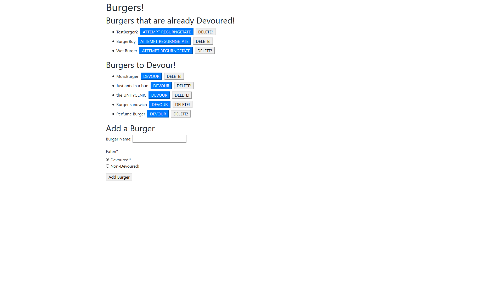

## Burger Muncho App

The purpose of this project is to quickly devour burgers and flex my recent knowledge by creating an app that uses, express, orms and handlebars to create a simple app that eats burgers

## How does it work?

A link to the project on GitHub can be found [Here](https://github.com/Alex-Waite/BurgerMuncho)! 
[Heroku link!](https://gentle-tor-23673.herokuapp.com/)

## Usage
The usage is quite simple, the user must navigate to the above heroku link and then may interact with the site,
Please note the delete, regurngetate and add button are all currently having issues

## Contact
If you have any questions or would like to report any bugs you can contact me at alexanderconorwaite@gmail.com

[Find me on linkedIn!](https://www.linkedin.com/in/alexander-waite-005165199/) 
  
